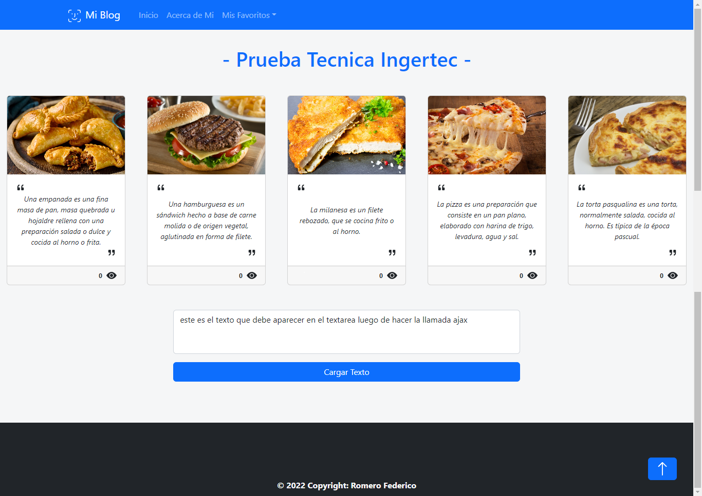
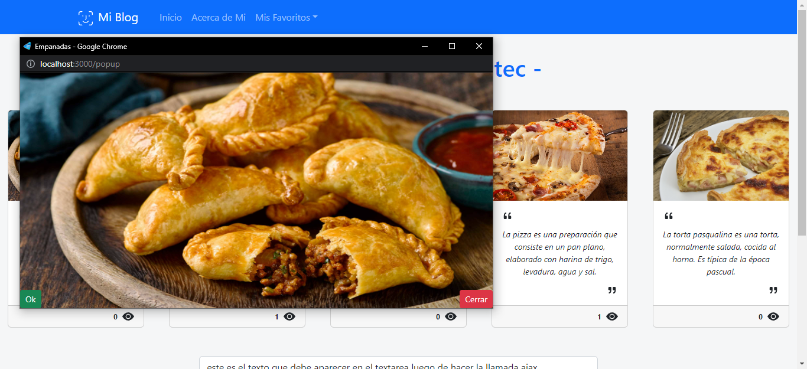

# Prueba Tecnica Ingertec - CLIENT


Cliente realizado para la prueba tecnica INGERTEC.

## Instrucciones
`NOTA:` Se requiere de las siguientes versiones de **NODE** y **NPM** para poder iniciar el cliente:
 * __Node__: 12.18.3 or higher
 * __NPM__: 6.14.16 or higher

Antes de inicar el cliente es necesario ejecutar el servidor donde estaran alojados los archivos estaticos utilizados.\
Para ello, seguir las instrucciones del siguiente repositorio:
[LINK](https://github.com/RomeroFederico/prueba-tecnica-ingertec-api)
 
A continuacion, copiar el repositorio e instalar las dependencias necesarias:
 ```bash
git clone https://github.com/RomeroFederico/prueba-tecnica-ingertec.git
npm install
```

Para finalizar e iniciar la pagina:
 ```bash
npm start
```
## Imagenes






